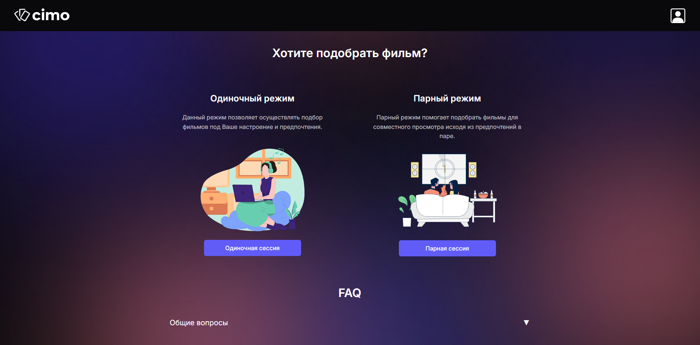

# CIMO

`CIMO` is a web application for personalized movie selection. It supports both **single-user** and **pair-based** recommendation modes, allowing users to find films suitable for solo viewing or watching together with a friend, partner, or family member.



The application includes the following features:

* Support for single and pair recommendation modes;
* User authentication and profile management;
* Ability to save and rate movies to improve recommendations;
* A built-in recommendation engine (MVP);
* Custom logic for generating pair-based movie suggestions;

`CIMO` is designed to enhance the movie selection experience through data-driven, context-aware recommendations.

---

## Tech Stack

### Backend

<div style="display: flex; flex-wrap: wrap; gap: 8px; margin-bottom: 12px;"> 
    
    
    
    
    
    
    
</div>

### Frontend

<div style="display: flex; flex-wrap: wrap; gap: 8px;"> 
    
    
    
    
</div>

## Project Configuration

To run the project, you must configure environment files for both the backend and frontend.

1. Create `.env.*` files in both `backend/` and `frontend/` directories.
2. Use the provided example files as a reference:
   - **Backend**: `backend/.env.example`
   - **Frontend**: `frontend/.env.example`
3. Replace placeholder values with actual credentials and secrets.
4. Extract the [test data archive](https://drive.google.com/drive/folders/1R4zqDwEF2zLtH0rUzQq0GdLqKq8c2JQ9?usp=sharing) into the following path: `./backend/app/data`


## Running with Docker

### 1. Set Environment and Use Git Bash

To avoid platform-specific issues (especially on Windows), use **Git Bash** or a compatible terminal. Export the `BUILD` environment variable to define which `.env` file should be used during startup. For example:

```bash
export BUILD=develop
```

This will use `.env.develop` as the environment config for the project. By default, Docker Compose reads `.env.${BUILD}` inside each service.

### 2. Build and Load Data

To build the project and automatically load test data into the database, run:
```bash
docker compose up -d db redis
docker compose --profile manual up load-data
```

This will:

* Build all services (`db`, `redis`, `backend`, workers, etc.);
* Load data using the `load-data` container (only if test data files exist);
* Stop the loader container when done;

### 3. Serve the Frontend (with `serve`)

To start the frontend with static server (e.g. after building via Vite):
```bash
docker compose --profile serve-mode up
```

This will:

* Build the frontend using the `Dockerfile.serve`;
* Serve the compiled **dist/** folder using serve;

### Show Logs

To inspect logs for all running containers:
```bash
docker compose logs -f
```

## Contact

**Email**: cinemood.corp@gmail.com

**Live Demo**: https://cimo-online.ru